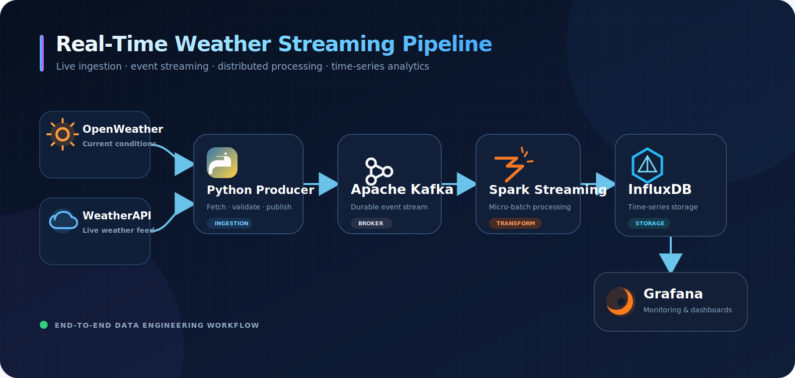

# Real-Time Weather Streaming Pipeline


An end-to-end data engineering project that collects live weather measurements from two providers, streams them through Apache Kafka, processes them with Spark Structured Streaming, stores time-series data in InfluxDB, and visualizes the results in Grafana.

## Architecture


## Main features

- Live collection from two independent weather APIs
- Reliable JSON event publication to Kafka
- Schema-based Spark Structured Streaming processing
- Micro-batch persistence in InfluxDB
- Grafana-ready time-series measurements
- Docker Compose infrastructure
- Environment-based secret management
- Graceful producer shutdown and HTTP error handling

## Technology stack

Python · Apache Kafka · Apache Spark · InfluxDB · Grafana · Docker Compose

## Project structure

```text
weather-streaming-pipeline/
  producer/
    weather_producer.py
  consumer/
    spark_consumer.py
  scripts/
    create_topic.ps1
    create_topic.sh
  docs/
    screenshots/
  docker-compose.yml
  requirements.txt
  .env.example
  .gitignore
  README.md
```

## Prerequisites

- Python 3.11
- Java 17 (required by Spark)
- Docker Desktop with Docker Compose
- OpenWeather API key
- WeatherAPI key

## Local setup

### 1. Configure environment variables

Copy the example configuration:

```powershell
Copy-Item .env.example .env
notepad .env
```

Replace every placeholder value in `.env`. Never commit this file.

### 2. Start the infrastructure

```powershell
docker compose up -d
docker compose ps
```

### 3. Create the Kafka topic

```powershell
.\scripts\create_topic.ps1
```

### 4. Create and activate a Python environment

```powershell
conda create -n weather_streaming python=3.11 -y
conda activate weather_streaming
pip install -r requirements.txt
```

### 5. Start the producer

```powershell
python .\producer\weather_producer.py
```

### 6. Start the Spark consumer

Open a second terminal in the project directory and run:

```powershell
conda activate weather_streaming

spark-submit `
  --packages org.apache.spark:spark-sql-kafka-0-10_2.12:3.5.1 `
  .\consumer\spark_consumer.py
```

Use a Kafka connector version compatible with the locally installed Spark version if it differs from the example above.

## Services

| Service | Address |
| --- | --- |
| Kafka | `localhost:9092` |
| InfluxDB | `http://localhost:8086` |
| Grafana | `http://localhost:3000` |

## Grafana connection

Add an InfluxDB data source in Grafana using the URL, organization, bucket, and token stored in `.env`. Create panels for:

- OpenWeather temperature
- WeatherAPI temperature
- Temperature difference between providers
- Humidity comparison
- Historical trends by city

## Security

Credentials and API keys are loaded from `.env`, which is excluded from Git. Only `.env.example` is published.

## Future improvements

- Multi-city collection
- Automated Grafana provisioning
- Data-quality alerts when providers disagree
- Unit and integration tests
- Kafka and Spark deployment inside containers
- CI validation with GitHub Actions

